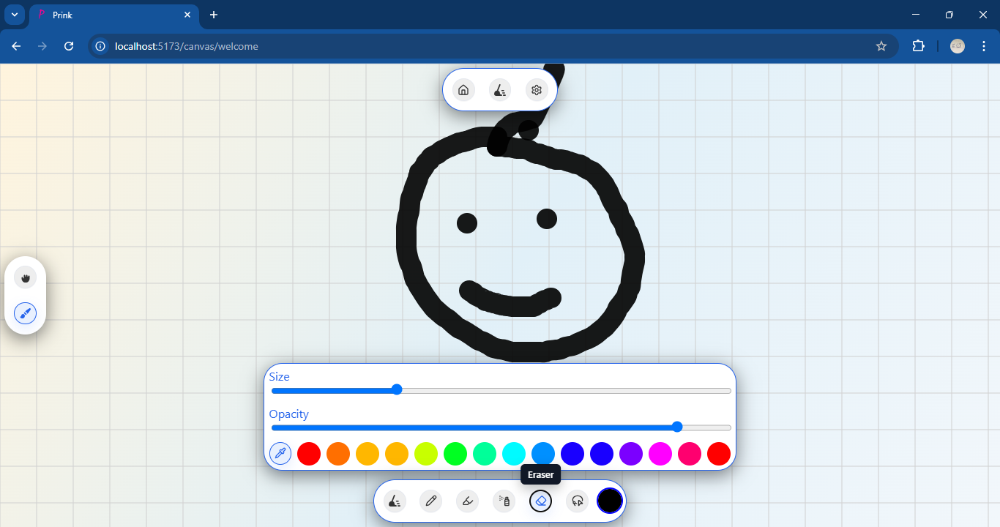

## 🔴 Demo

### 🖼️ Screenshot

### 🎥 Video

https://github.com/user-attachments/assets/77f8b537-eb2e-4b50-b991-a537b385f9a8

⬇️[Demo Video Download](public/videos/prink-2.mp4)

### ↗️ Link
https://pridebnath.github.io/prink-prototype-version-2

--- 
## Prink 2.0 - Canvas Drawing Application

A web-based drawing application built with React and TypeScript, featuring a dual-canvas architecture for smooth drawing experiences.

## 📋 Project Status: **DISCONTINUED**

This project has been discontinued. Below is an honest assessment of what worked well and why we stopped.

---

## ✅ **What Worked Well (The Good)**

### 🎨 **Core Drawing Experience**
- **Smooth Drawing Performance**: Implemented object pooling for Point objects, reducing garbage collection pressure by 50-80%
- **Dual Canvas Architecture**: Separate grid and drawing canvases provide clean separation of concerns
- **Advanced Brush System**: Multiple brush types (Pencil, Airbrush) with proper caching for performance
- **Responsive Design**: Works on both desktop and mobile devices with proper touch support

### 🚀 **Technical Excellence**
- **Performance Optimizations**: 
  - Dirty rectangle tracking for selective redraws
  - Brush instance caching to avoid recreation
  - RequestAnimationFrame-based drawing loop
  - Memory-efficient point pooling system
- **Modern Tech Stack**: React 19, TypeScript, Vite, TanStack Router
- **Clean Architecture**: Well-structured component hierarchy and utility separation
- **Type Safety**: Comprehensive TypeScript types for all drawing operations

### 🛠 **Developer Experience**
- **Comprehensive Documentation**: Detailed explanations of canvas coordinate systems and performance optimizations
- **Code Comments**: Extensive inline documentation explaining complex drawing logic
- **Modular Design**: Clean separation between tools, brushes, and drawing utilities

---

---

## 🤔 **Why We're Stopping Development**

### Sole reason
We are discontinuing Prink solely due to performance degradation when many strokes/paths accumulate. After extended drawing sessions, rendering begins to lag noticeably despite existing optimizations. We are pausing further work rather than pursuing deeper engine-level rewrites.

### Future direction
We are exploring a move to a GPU-accelerated renderer (WebGL/WebGL2) to overcome CPU-bound canvas bottlenecks and achieve stable performance at scale.

---

## 📚 **What We Learned**

### **Positive Takeaways**
- **Performance Matters**: Object pooling and caching significantly improve drawing smoothness
- **Architecture**: Dual-canvas approach works well for separating concerns
- **Modern Tools**: React + TypeScript + Vite provides excellent developer experience

### **Key Lessons**
- **Start Simple**: Should have focused on core features before adding complexity
- **User Feedback**: Needed earlier user testing to validate feature priorities
- **Competitive Analysis**: Should have better understood the competitive landscape before starting

---

 
